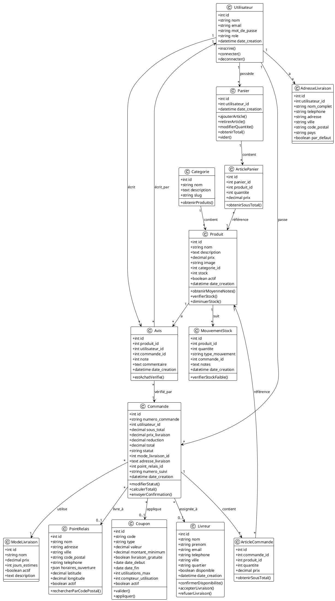
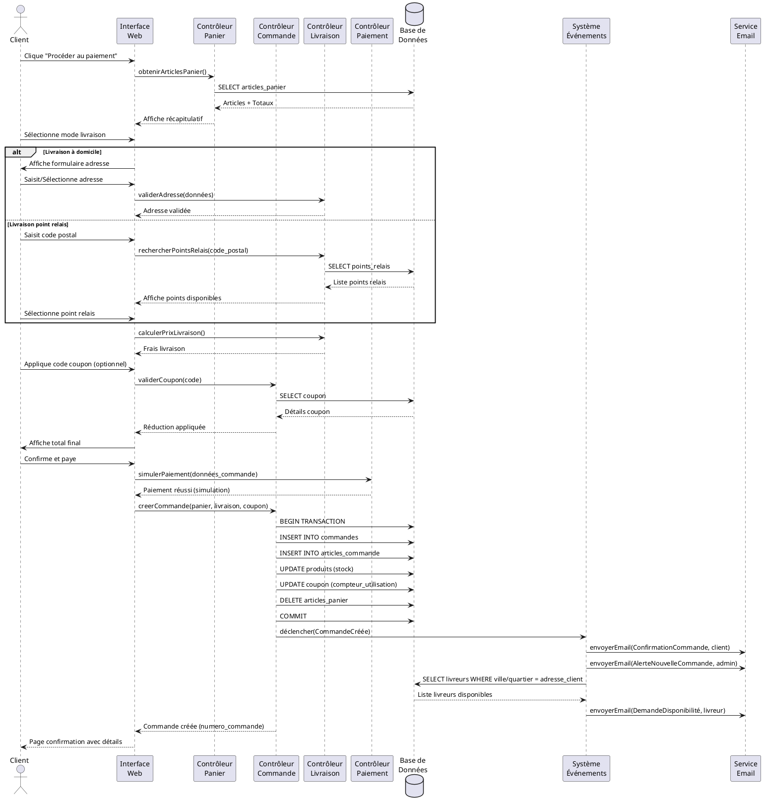
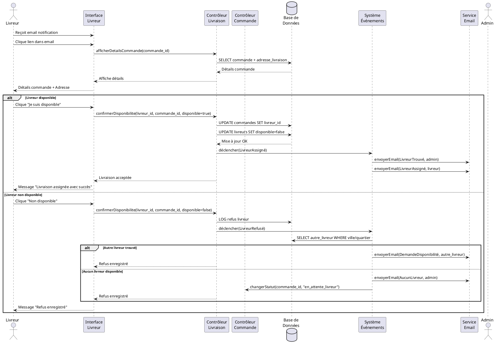
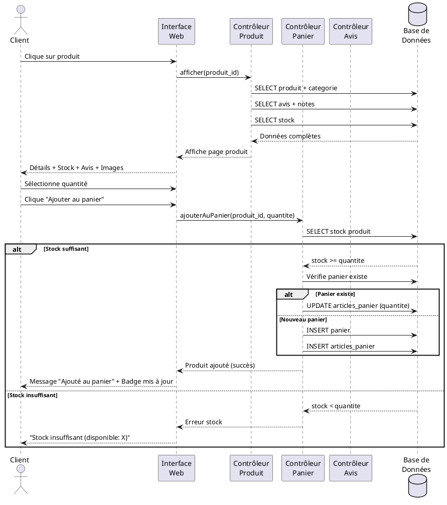
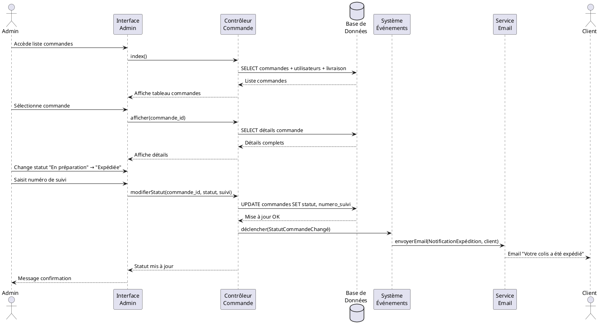
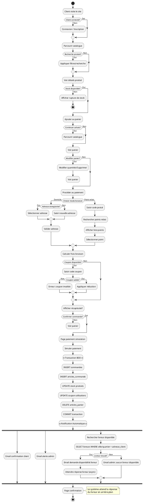
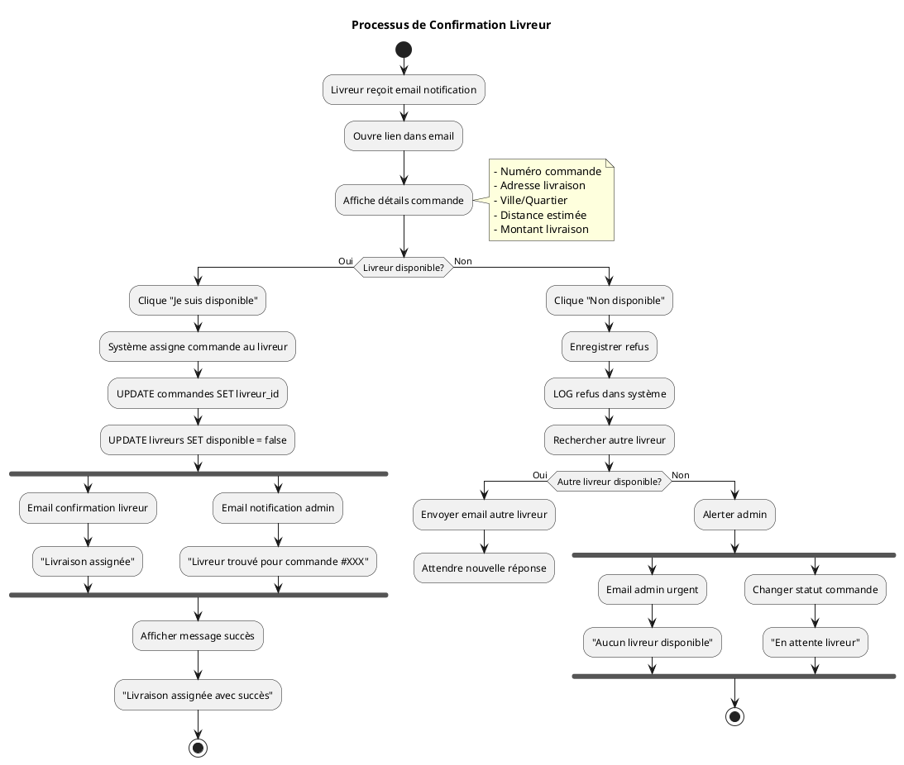
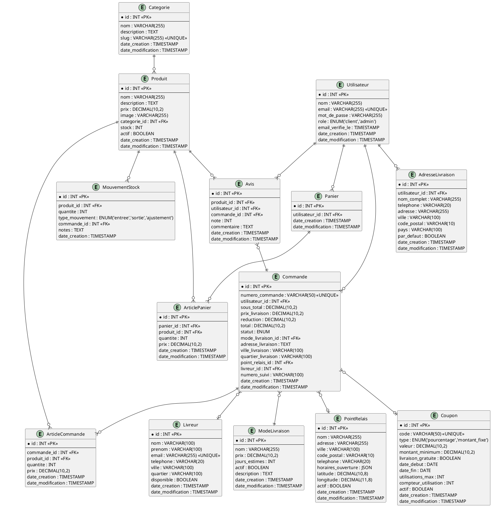

# 📋 Codes PlantUML - Mini Amazon

## 🌐 Plateformes en ligne pour visualiser:

1. **PlantUML Online Server:** https://www.plantuml.com/plantuml/
2. **PlantText:** https://www.planttext.com/
3. **PlantUML QEditor:** https://plantuml-editor.kkeisuke.com/

**Instructions:** Copiez le code d'un diagramme ci-dessous et collez-le dans l'une de ces plateformes.

---

## 1️⃣ DIAGRAMME DE CLASSES

---

## 2️⃣ DIAGRAMME DE CAS D'UTILISATION

```plantuml
@startuml

left to right direction

actor "Client" as Client
actor "Administrateur" as Admin
actor "Livreur" as Livreur
actor "Système" as System

rectangle "Mini Amazon E-Commerce" {
  
  package "Cas d'utilisation Client" {
    usecase "S'inscrire / Se connecter" as UC1
    usecase "Consulter catalogue produits" as UC2
    usecase "Rechercher produits" as UC3
    usecase "Voir détails produit" as UC4
    usecase "Ajouter au panier" as UC5
    usecase "Gérer panier" as UC6
    usecase "Choisir mode livraison" as UC7
    usecase "Sélectionner point relais" as UC8
    usecase "Saisir adresse livraison" as UC9
    usecase "Appliquer coupon" as UC10
    usecase "Passer commande" as UC11
    usecase "Simuler paiement" as UC12
    usecase "Consulter historique commandes" as UC13
    usecase "Suivre livraison" as UC14
    usecase "Laisser avis produit" as UC15
    usecase "Gérer adresses livraison" as UC16
  }
  
  package "Cas d'utilisation Admin" {
    usecase "Gérer produits (CRUD)" as UC20
    usecase "Gérer catégories" as UC21
    usecase "Gérer stocks" as UC22
    usecase "Voir dashboard statistiques" as UC23
    usecase "Gérer commandes" as UC24
    usecase "Changer statut commande" as UC25
    usecase "Ajouter numéro suivi" as UC26
    usecase "Gérer coupons" as UC27
    usecase "Gérer points relais" as UC28
    usecase "Configurer modes livraison" as UC29
    usecase "Gérer utilisateurs" as UC30
    usecase "Consulter avis clients" as UC31
    usecase "Voir alertes stock" as UC32
  }
  
  package "Cas d'utilisation Livreur" {
    usecase "S'inscrire comme livreur" as UC50
    usecase "Recevoir notification commande" as UC51
    usecase "Confirmer disponibilité" as UC52
    usecase "Accepter livraison" as UC53
    usecase "Refuser livraison" as UC54
    usecase "Voir commandes assignées" as UC55
    usecase "Mettre à jour statut livraison" as UC56
  }
  
  package "Cas d'utilisation Système" {
    usecase "Envoyer email confirmation" as UC40
    usecase "Envoyer notification statut" as UC41
    usecase "Vérifier stock disponible" as UC42
    usecase "Calculer frais livraison" as UC43
    usecase "Décompter stock" as UC44
    usecase "Alerter stock faible" as UC45
    usecase "Valider coupon" as UC46
    usecase "Trouver livreur disponible" as UC47
    usecase "Envoyer email livreur" as UC48
  }
}

Client --> UC1
Client --> UC2
Client --> UC3
Client --> UC4
Client --> UC5
Client --> UC6
Client --> UC7
Client --> UC10
Client --> UC11
Client --> UC13
Client --> UC14
Client --> UC15
Client --> UC16

Admin --> UC20
Admin --> UC21
Admin --> UC22
Admin --> UC23
Admin --> UC24
Admin --> UC25
Admin --> UC26
Admin --> UC27
Admin --> UC28
Admin --> UC29
Admin --> UC30
Admin --> UC31
Admin --> UC32

UC11 .> UC7 : <<include>>
UC7 .> UC8 : <<extend>>
UC7 .> UC9 : <<extend>>
UC11 .> UC12 : <<include>>
UC15 .> UC13 : <<require>>

Livreur --> UC50
Livreur --> UC51
Livreur --> UC52
Livreur --> UC53
Livreur --> UC54
Livreur --> UC55
Livreur --> UC56

UC11 --> System
UC25 --> System
UC52 .> UC51 : <<require>>
UC53 .> UC52 : <<extend>>
UC54 .> UC52 : <<extend>>

System --> UC40
System --> UC41
System --> UC42
System --> UC43
System --> UC44
System --> UC45
System --> UC46
System --> UC47
System --> UC48

@enduml
```

---

## 3️⃣ DIAGRAMME DE SÉQUENCE - PASSAGE DE COMMANDE

---

## 4️⃣ DIAGRAMME DE SÉQUENCE - CONFIRMATION LIVREUR

---

## 5️⃣ DIAGRAMME DE SÉQUENCE - AJOUT AU PANIER

---

## 6️⃣ DIAGRAMME DE SÉQUENCE - CHANGEMENT STATUT COMMANDE (ADMIN)

---

## 7️⃣ DIAGRAMME D'ACTIVITÉ - PROCESSUS DE COMMANDE

---

## 8️⃣ DIAGRAMME D'ACTIVITÉ - RÉPONSE LIVREUR

---

## 9️⃣ DIAGRAMME MCD (MODÈLE CONCEPTUEL DES DONNÉES)

---

## 📝 Instructions d'utilisation:

### Méthode 1: Plateforme en ligne
1. **Choisir une plateforme:**
   - https://www.plantuml.com/plantuml/ (Officiel)
   - https://www.planttext.com/ (Alternative simple)
   - https://plantuml-editor.kkeisuke.com/ (Éditeur visuel)

2. **Copier le code** d'un diagramme ci-dessus (tout entre @startuml et @enduml)

3. **Coller le code** dans l'éditeur de la plateforme

4. **Le diagramme s'affiche** automatiquement

5. **Télécharger** en PNG, SVG ou PDF selon vos besoins

### Méthode 2: Extension VS Code (Recommandé)
1. Installer l'extension **PlantUML** dans VS Code
2. Créer un fichier `.puml` et coller le code
3. Appuyer sur `Alt+D` pour prévisualiser
4. Exporter en cliquant droit → Export Current Diagram

### Méthode 3: Application de bureau
- Télécharger **PlantUML QEditor** sur GitHub
- Interface graphique avec prévisualisation en temps réel
