# Diagrammes d'Activité - Mini Amazon

## 🔗 Visualiser les diagrammes
**Lien PlantUML 1:** [Processus complet de commande](http://www.plantuml.com/plantuml/uml/bLLjSzj047tNhxZI2YM3OjHLmYQH4aKP5gKO8Y4aY9QpYaYaYb4YcGYd0Yd1Ye2Yf3Yg4Yh5Yi6Yj7Yk8Yl9YmAYnBYoCYpDYqEYrFYsGYtHYuIYvJYwKYxLYyMYzNY-OY_PYARYBSYCTYDUYEVYFWYGXYHYYIZYJaYKbYLcYMdYNeYOfYPgYQhYRiYSjYTkYUlYVmYWnYXoYYpYZqY-rY_sYAtYBuYCvYDwYExYFyYGzYH-YI_YJAYKCYLDYMEYNG)

**Lien PlantUML 2:** [Gestion admin - traitement commande](http://www.plantuml.com/plantuml/uml/bLLjSzj047tNhxZI2YM3OjHLmYQH4aKP5gKO8Y4aY9QpYaYaYb4YcGYd0Yd1Ye2Yf3Yg4Yh5Yi6Yj7Yk8Yl9YmAYnBYoCYpDYqEYrFYsGYtHYuIYvJYwKYxLYyMYzNY-OY_PYARYBSYCTYDUYEVYFWYGXYHYYIZYJaYKbYLcYMdYNeYOfYPgYQhYRiYSjYTkYUlYVmYWnYXoYYpYZqY-rY_sYAtYBuYCvYDwYExYFyYGzYH-YI_YJAYKCYLDYMEYNG)

## 1. Activité: Processus Complet de Commande

```mermaid
flowchart TD
    Start([Client visite le site]) --> Auth{Client<br/>connecté?}
    Auth -->|Non| Login[Connexion / Inscription]
    Login --> Browse
    Auth -->|Oui| Browse[Parcourir catalogue]
    
    Browse --> Search{Recherche<br/>produit?}
    Search -->|Oui| Filter[Appliquer filtres/recherche]
    Filter --> ViewProduct
    Search -->|Non| ViewProduct[Voir détails produit]
    
    ViewProduct --> CheckStock{Stock<br/>disponible?}
    CheckStock -->|Non| OutOfStock[Afficher rupture de stock]
    OutOfStock --> Browse
    
    CheckStock -->|Oui| AddCart[Ajouter au panier]
    AddCart --> ContinueShopping{Continuer<br/>achats?}
    ContinueShopping -->|Oui| Browse
    
    ContinueShopping -->|Non| ViewCart[Voir panier]
    ViewCart --> ModifyCart{Modifier<br/>panier?}
    ModifyCart -->|Oui| UpdateQty[Modifier quantités/Supprimer]
    UpdateQty --> ViewCart
    
    ModifyCart -->|Non| Checkout[Procéder au paiement]
    Checkout --> ChooseDelivery{Choisir mode<br/>livraison}
    
    ChooseDelivery -->|Domicile| HomeDelivery[Livraison à domicile]
    HomeDelivery --> HasAddress{Adresse<br/>enregistrée?}
    HasAddress -->|Oui| SelectAddress[Sélectionner adresse]
    HasAddress -->|Non| EnterAddress[Saisir nouvelle adresse]
    SelectAddress --> ValidateAddress
    EnterAddress --> ValidateAddress[Valider adresse]
    
    ChooseDelivery -->|Point relais| RelayDelivery[Livraison point relais]
    RelayDelivery --> EnterPostal[Saisir code postal]
    EnterPostal --> SearchRelay[Rechercher points relais]
    SearchRelay --> ShowRelay[Afficher liste points]
    ShowRelay --> SelectRelay[Sélectionner point]
    
    ValidateAddress --> CalcDelivery[Calculer frais livraison]
    SelectRelay --> CalcDelivery
    
    CalcDelivery --> ApplyCoupon{Coupon<br/>disponible?}
    ApplyCoupon -->|Oui| EnterCoupon[Saisir code coupon]
    EnterCoupon --> ValidateCoupon{Coupon<br/>valide?}
    ValidateCoupon -->|Non| InvalidCoupon[Erreur: coupon invalide]
    InvalidCoupon --> ShowSummary
    ValidateCoupon -->|Oui| ApplyDiscount[Appliquer réduction]
    ApplyDiscount --> ShowSummary
    ApplyCoupon -->|Non| ShowSummary[Afficher récapitulatif]
    
    ShowSummary --> ConfirmOrder{Confirmer<br/>commande?}
    ConfirmOrder -->|Non| ViewCart
    
    ConfirmOrder -->|Oui| Payment[Page paiement simulation]
    Payment --> SimulatePay[Simuler paiement]
    SimulatePay --> CreateOrder[Créer commande]
    
    CreateOrder --> Transaction[Transaction BDD]
    Transaction --> InsertOrder[INSERT orders]
    InsertOrder --> InsertItems[INSERT order_items]
    InsertItems --> UpdateStock[UPDATE products stock]
    UpdateStock --> UpdateCoupon[UPDATE coupon used_count]
    UpdateCoupon --> ClearCart[DELETE cart_items]
    ClearCart --> Commit[COMMIT transaction]
    
    Commit --> SendEmails[Envoyer emails]
    SendEmails --> EmailClient[Email confirmation client]
    SendEmails --> EmailAdmin[Email alerte admin]
    
    EmailClient --> OrderSuccess[Page confirmation]
    EmailAdmin --> OrderSuccess
    OrderSuccess --> End([Fin])
    
    style Start fill:#90EE90
    style End fill:#FFB6C1
    style Payment fill:#FFD700
    style CreateOrder fill:#87CEEB
    style SendEmails fill:#DDA0DD
```



---

## 2. Activité: Gestion Admin - Traitement Commande

```mermaid
flowchart TD
    Start([Nouvelle commande reçue]) --> NotifyAdmin[Email notification admin]
    NotifyAdmin --> AdminLogin[Admin se connecte]
    
    AdminLogin --> Dashboard[Voir dashboard]
    Dashboard --> OrderList[Liste commandes]
    
    OrderList --> SelectOrder[Sélectionner commande]
    SelectOrder --> ViewDetails[Voir détails]
    
    ViewDetails --> CheckStatus{Statut<br/>actuel?}
    
    CheckStatus -->|En attente| Validate[Valider commande]
    Validate --> ChangeStatus1[Statut → Confirmée]
    ChangeStatus1 --> SendEmail1[Email client: confirmée]
    
    CheckStatus -->|Confirmée| Prepare[Préparer produits]
    Prepare --> CheckStock{Stock<br/>suffisant?}
    CheckStock -->|Non| ContactClient[Contacter client]
    ContactClient --> Refund[Remboursement partiel]
    Refund --> ViewDetails
    
    CheckStock -->|Oui| ChangeStatus2[Statut → En préparation]
    ChangeStatus2 --> SendEmail2[Email client: en préparation]
    
    SendEmail1 --> Package[Emballer colis]
    SendEmail2 --> Package
    Package --> ChangeStatus3[Statut → Expédiée]
    
    ChangeStatus3 --> EnterTracking[Saisir numéro suivi]
    EnterTracking --> UpdateDB[UPDATE tracking_number]
    UpdateDB --> SendEmail3[Email client: expédiée + tracking]
    
    SendEmail3 --> Transit[Colis en transit]
    Transit --> ChangeStatus4[Statut → En cours de livraison]
    ChangeStatus4 --> SendEmail4[Email: colis arrive]
    
    SendEmail4 --> Delivery{Mode<br/>livraison?}
    
    Delivery -->|Domicile| HomeDeliv[Livreur se rend au domicile]
    Delivery -->|Point relais| RelayDeliv[Dépôt au point relais]
    
    HomeDeliv --> Delivered
    RelayDeliv --> Delivered[Livraison effectuée]
    
    Delivered --> ChangeStatus5[Statut → Livrée]
    ChangeStatus5 --> SendEmail5[Email: commande livrée]
    SendEmail5 --> InviteReview[Invitation laisser avis]
    
    InviteReview --> End([Fin])
    
    style Start fill:#90EE90
    style End fill:#FFB6C1
    style Package fill:#FFD700
    style SendEmail3 fill:#87CEEB
```



---

## 3. Activité: Système - Vérification Stock Automatique

```mermaid
flowchart TD
    Start([Tâche planifiée quotidienne]) --> CronJob[Cron exécuté 9h00]
    
    CronJob --> Query[SELECT products WHERE stock < threshold]
    Query --> HasResults{Produits<br/>stock faible?}
    
    HasResults -->|Non| LogOK[Logger: tous stocks OK]
    LogOK --> End1([Fin])
    
    HasResults -->|Oui| BuildList[Construire liste produits]
    BuildList --> CreateAlert[Créer rapport HTML]
    
    CreateAlert --> SendAdmin[Envoyer email admin]
    SendAdmin --> UpdateFlag[UPDATE alert_sent_at]
    
    UpdateFlag --> CheckCritical{Stock = 0?}
    
    CheckCritical -->|Oui| DisableProduct[Désactiver produit]
    DisableProduct --> UpdateStatus[UPDATE is_active = false]
    UpdateStatus --> NotifyUrgent[Email URGENT admin]
    NotifyUrgent --> End2
    
    CheckCritical -->|Non| End2([Fin])
    
    style Start fill:#90EE90
    style End1 fill:#98FB98
    style End2 fill:#FFB6C1
    style NotifyUrgent fill:#FF6347
```



---

## 4. Activité: Client - Laisser un Avis

```mermaid
flowchart TD
    Start([Client visite historique]) --> Login{Connecté?}
    Login -->|Non| RedirectLogin[Redirection connexion]
    RedirectLogin --> Start
    
    Login -->|Oui| LoadOrders[Charger commandes livrées]
    LoadOrders --> ShowOrders[Afficher liste]
    
    ShowOrders --> SelectProduct[Sélectionner produit]
    SelectProduct --> CheckReviewed{Avis déjà<br/>donné?}
    
    CheckReviewed -->|Oui| ShowExisting[Afficher avis existant]
    ShowExisting --> CanEdit{Modifier<br/>avis?}
    CanEdit -->|Non| End1([Fin])
    CanEdit -->|Oui| EditForm[Formulaire modification]
    
    CheckReviewed -->|Non| VerifyPurchase{Achat<br/>vérifié?}
    VerifyPurchase -->|Non| ErrorMsg[Erreur: doit acheter]
    ErrorMsg --> End2([Fin])
    
    VerifyPurchase -->|Oui| ReviewForm[Formulaire avis]
    EditForm --> ReviewForm
    
    ReviewForm --> SelectRating[Sélectionner étoiles 1-5]
    SelectRating --> WriteComment[Écrire commentaire optionnel]
    WriteComment --> UploadPhoto{Ajouter<br/>photo?}
    
    UploadPhoto -->|Oui| UploadImage[Upload image]
    UploadImage --> ValidateImage{Image<br/>valide?}
    ValidateImage -->|Non| ErrorImage[Erreur format/taille]
    ErrorImage --> UploadPhoto
    ValidateImage -->|Oui| Preview
    
    UploadPhoto -->|Non| Preview[Prévisualiser avis]
    Preview --> Submit{Soumettre?}
    
    Submit -->|Non| ReviewForm
    Submit -->|Oui| SaveReview[INSERT review]
    
    SaveReview --> UpdateAverage[Recalculer moyenne produit]
    UpdateAverage --> Success[Message succès]
    Success --> End3([Fin])
    
    style Start fill:#90EE90
    style End1 fill:#FFB6C1
    style End2 fill:#FFB6C1
    style End3 fill:#98FB98
    style Success fill:#FFD700
```



---

## 5. Activité: Recherche et Filtrage Produits

```mermaid
flowchart TD
    Start([Page d'accueil]) --> ViewCatalog[Voir catalogue]
    
    ViewCatalog --> FilterChoice{Action?}
    
    FilterChoice -->|Recherche texte| EnterKeyword[Saisir mot-clé]
    EnterKeyword --> SearchDB[SELECT products WHERE name/description LIKE]
    
    FilterChoice -->|Catégorie| SelectCat[Sélectionner catégorie]
    SelectCat --> FilterCat[SELECT products WHERE category_id]
    
    FilterChoice -->|Prix| SelectPrice[Sélectionner fourchette]
    SelectPrice --> FilterPrice[SELECT products WHERE price BETWEEN]
    
    FilterChoice -->|Note| SelectRating[Sélectionner note min]
    SelectRating --> FilterRating[JOIN reviews, moyenne >= X]
    
    FilterChoice -->|Tri| SelectSort[Ordre: prix/date/popularité]
    SelectSort --> ApplySort[ORDER BY column]
    
    SearchDB --> CombineFilters[Combiner tous filtres actifs]
    FilterCat --> CombineFilters
    FilterPrice --> CombineFilters
    FilterRating --> CombineFilters
    ApplySort --> CombineFilters
    
    CombineFilters --> ExecuteQuery[Exécuter requête SQL]
    ExecuteQuery --> HasResults{Résultats<br/>trouvés?}
    
    HasResults -->|Non| NoResults[Afficher "Aucun produit trouvé"]
    NoResults --> Suggestions[Proposer produits similaires]
    Suggestions --> DisplayResults
    
    HasResults -->|Oui| Paginate[Paginer résultats 12/page]
    Paginate --> DisplayResults[Afficher grille produits]
    
    DisplayResults --> UserAction{Action?}
    
    UserAction -->|Voir produit| ProductDetail[Page détails]
    ProductDetail --> End1([Fin])
    
    UserAction -->|Changer filtres| FilterChoice
    UserAction -->|Page suivante| NextPage[Charger page suivante]
    NextPage --> DisplayResults
    
    UserAction -->|Quitter| End2([Fin])
    
    style Start fill:#90EE90
    style End1 fill:#FFB6C1
    style End2 fill:#FFB6C1
    style DisplayResults fill:#87CEEB
```
