# Diagramme de Cas d'Utilisation - Mini Amazon

## 🔗 Visualiser le diagramme
**Lien PlantUML:** [Voir le diagramme de cas d'utilisation](http://www.plantuml.com/plantuml/uml/jLRTRjim57tNhxZoKYM2FeHPQqC8XHYXsq8qPR5ajQkh9AjsYOsuQjxxtSxfqt9fSsfQyOzyzpxxpypqvdVlm7Lxr2Gx2qxWLGNGqGUG0N0d0a9GfG0w0eaGCa5W8PW8OW9Wm3WPG0rW8CW1q1Pq0uG1G2L1k2Lq0-n0Eq0Fq0Gq0Hq0Iq0Jq0Kq0Lq0Mq0Nq0Oq0Pq0Qq0Rq0Sq0Tq0Uq0Vq0Wq0Xq0Yq0Zq10q11q12q13q14q15q16q17q18q19q20q21q22q23q24q25q26q27q28q29q30q31q32q33q34q35q36q37q38q39q40q41q42q43q44q45q46q)

```plantuml
@startuml

left to right direction

actor "Client" as Client
actor "Administrateur" as Admin
actor "Système" as System

rectangle "Mini Amazon E-Commerce" {
  
  package "Cas d'utilisation Client" {
    usecase "S'inscrire / Se connecter" as UC1
    usecase "Consulter catalogue produits" as UC2
    usecase "Rechercher produits" as UC3
    usecase "Voir détails produit" as UC4
    usecase "Ajouter au panier" as UC5
    usecase "Gérer panier" as UC6
    usecase "Choisir mode livraison" as UC7
    usecase "Sélectionner point relais" as UC8
    usecase "Saisir adresse livraison" as UC9
    usecase "Appliquer coupon" as UC10
    usecase "Passer commande" as UC11
    usecase "Simuler paiement" as UC12
    usecase "Consulter historique commandes" as UC13
    usecase "Suivre livraison" as UC14
    usecase "Laisser avis produit" as UC15
    usecase "Gérer adresses livraison" as UC16
  }
  
  package "Cas d'utilisation Admin" {
    usecase "Gérer produits (CRUD)" as UC20
    usecase "Gérer catégories" as UC21
    usecase "Gérer stocks" as UC22
    usecase "Voir dashboard statistiques" as UC23
    usecase "Gérer commandes" as UC24
    usecase "Changer statut commande" as UC25
    usecase "Ajouter numéro suivi" as UC26
    usecase "Gérer coupons" as UC27
    usecase "Gérer points relais" as UC28
    usecase "Configurer modes livraison" as UC29
    usecase "Gérer utilisateurs" as UC30
    usecase "Consulter avis clients" as UC31
    usecase "Voir alertes stock" as UC32
  }
  
  package "Cas d'utilisation Système" {
    usecase "Envoyer email confirmation" as UC40
    usecase "Envoyer notification statut" as UC41
    usecase "Vérifier stock disponible" as UC42
    usecase "Calculer frais livraison" as UC43
    usecase "Décompter stock" as UC44
    usecase "Alerter stock faible" as UC45
    usecase "Valider coupon" as UC46
  }
}

' Relations Client
Client --> UC1
Client --> UC2
Client --> UC3
Client --> UC4
Client --> UC5
Client --> UC6
Client --> UC7
Client --> UC10
Client --> UC11
Client --> UC13
Client --> UC14
Client --> UC15
Client --> UC16

' Relations Admin
Admin --> UC20
Admin --> UC21
Admin --> UC22
Admin --> UC23
Admin --> UC24
Admin --> UC25
Admin --> UC26
Admin --> UC27
Admin --> UC28
Admin --> UC29
Admin --> UC30
Admin --> UC31
Admin --> UC32

' Inclusions et extensions
UC11 .> UC7 : <<include>>
UC7 .> UC8 : <<extend>>
UC7 .> UC9 : <<extend>>
UC11 .> UC12 : <<include>>
UC15 .> UC13 : <<require>>

' Système
UC11 --> System
UC25 --> System
System --> UC40
System --> UC41
System --> UC42
System --> UC43
System --> UC44
System --> UC45
System --> UC46

@enduml
```

```mermaid
graph TB
    subgraph "Acteurs"
        Client[👤 Client]
        Admin[👨‍💼 Administrateur]
        Systeme[⚙️ Système]
    end

    subgraph "Cas d'utilisation - Client"
        UC1[S'inscrire / Se connecter]
        UC2[Consulter catalogue produits]
        UC3[Rechercher produits]
        UC4[Voir détails produit]
        UC5[Ajouter au panier]
        UC6[Gérer panier]
        UC7[Choisir mode livraison]
        UC8[Sélectionner point relais]
        UC9[Saisir adresse livraison]
        UC10[Appliquer coupon]
        UC11[Passer commande]
        UC12[Simuler paiement]
        UC13[Consulter historique commandes]
        UC14[Suivre livraison]
        UC15[Laisser avis produit]
        UC16[Gérer adresses livraison]
    end

    subgraph "Cas d'utilisation - Admin"
        UC20[Gérer produits CRUD]
        UC21[Gérer catégories]
        UC22[Gérer stocks]
        UC23[Voir dashboard statistiques]
        UC24[Gérer commandes]
        UC25[Changer statut commande]
        UC26[Ajouter numéro suivi]
        UC27[Gérer coupons]
        UC28[Gérer points relais]
        UC29[Configurer modes livraison]
        UC30[Gérer utilisateurs]
        UC31[Consulter avis clients]
        UC32[Voir alertes stock]
    end

    subgraph "Cas d'utilisation - Système"
        UC40[Envoyer email confirmation]
        UC41[Envoyer notification statut]
        UC42[Vérifier stock disponible]
        UC43[Calculer frais livraison]
        UC44[Décompter stock]
        UC45[Alerter stock faible]
        UC46[Valider coupon]
    end

    %% Relations Client
    Client --> UC1
    Client --> UC2
    Client --> UC3
    Client --> UC4
    Client --> UC5
    Client --> UC6
    Client --> UC7
    Client --> UC8
    Client --> UC9
    Client --> UC10
    Client --> UC11
    Client --> UC12
    Client --> UC13
    Client --> UC14
    Client --> UC15
    Client --> UC16

    %% Relations Admin
    Admin --> UC20
    Admin --> UC21
    Admin --> UC22
    Admin --> UC23
    Admin --> UC24
    Admin --> UC25
    Admin --> UC26
    Admin --> UC27
    Admin --> UC28
    Admin --> UC29
    Admin --> UC30
    Admin --> UC31
    Admin --> UC32

    %% Inclusions / Extensions
    UC11 -.include.-> UC7
    UC7 -.extend.-> UC8
    UC7 -.extend.-> UC9
    UC11 -.include.-> UC12
    UC11 --> Systeme
    UC15 -.require.-> UC13
    UC25 --> Systeme

    %% Système déclenché
    Systeme --> UC40
    Systeme --> UC41
    Systeme --> UC42
    Systeme --> UC43
    Systeme --> UC44
    Systeme --> UC45
    Systeme --> UC46
```

## Description des cas d'utilisation principaux

### 🛍️ **Parcours Client**
1. **Authentification** → Inscription/Connexion
2. **Navigation** → Catalogue, Recherche, Filtres
3. **Sélection** → Détails produit, Ajout panier
4. **Commande** → Panier, Livraison, Paiement
5. **Suivi** → Historique, Tracking, Avis

### 👨‍💼 **Parcours Admin**
1. **Gestion Catalogue** → Produits, Catégories, Stocks
2. **Gestion Commandes** → Validation, Expédition, Tracking
3. **Gestion Livraison** → Points relais, Modes, Tarifs
4. **Marketing** → Coupons, Promotions
5. **Monitoring** → Dashboard, Statistiques, Alertes

### ⚙️ **Actions Système**
- Envoi automatique emails
- Vérification stocks temps réel
- Calculs automatiques (totaux, frais)
- Alertes administrateur
