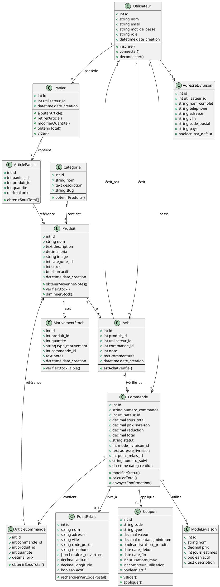

# Diagramme de Classes - Mini Amazon

## 🔗 Visualiser le diagramme
**Lien PlantUML:** [Voir le diagramme de classes](http://www.plantuml.com/plantuml/uml/rLTDRzis4BtxLuozAagzWKXD4rNs8ecxHM4qcIbIhScjjHMtOCkI8grQ_lvYtqEqRx7pxq7bUZVltNVtavmTRs2RJKXqqoGxXPr30YujGXDOGo5KR4j0gYWv72a9G8L0r0mGIXTWH8YP1G-9Wml0FLG84eF8WTmXXn0KkLZuO5cN0pmGlZuX78fWPG7W8D0m0p0OW1k2L9fW0_W0PW3EH0wm1_q1L1D1r0lW0Dy0S9k0Fq2F9e0DW2Fy0-HG0eH29W0QX2CnW00P29W07C08t0Od04t0Sd05t0Yd06t0hb0Jd08Z0Nn0Au0Qu0Tv15x0Wv16x0Xx17x0Yx18x1Zy19y0-z0Az0Bz0Cz0Dz0Ey1Fz1Gz1Hz1Iz1Jz1Kz1Lz1My2Nz2Oz2Pz2Qz2Ry3Sz3Tz3Uz3Vz3Wz3Xy4Yz4_4-5B5C5D5E5F5G5H5I5J5K5L5M5N5O5P5Q5R5S5T5U5V5W5X5Y5Z6_6-7B7C7D7E7F7G7H7I7J7K7L7M7N7O7P7Q7R7S7T7U7V7W7X7Y7Z8_8-9B9C9D9E9F9G9H9I9J9K9L9M9N9O9P9Q9R9S9T9U9V9W9X9Y9ZA_A-BB)

## Relations principales:
- **Utilisateur** ↔ Panier, Commande, Avis, AdresseLivraison
- **Produit** ↔ Categorie, ArticlePanier, ArticleCommande, Avis, MouvementStock
- **Commande** ↔ ArticleCommande, ModeLivraison, PointRelais, Coupon
- **Panier** ↔ ArticlePanier
