# Diagramme de Classes - Mini Amazon

## 🔗 Visualiser le diagramme
**Lien PlantUML:** [Voir le diagramme de classes](http://www.plantuml.com/plantuml/uml/rLTDRzis4BtxLuozAagzWKXD4rNs8ecxHM4qcIbIhScjjHMtOCkI8grQ_lvYtqEqRx7pxq7bUZVltNVtavmTRs2RJKXqqoGxXPr30YujGXDOGo5KR4j0gYWv72a9G8L0r0mGIXTWH8YP1G-9Wml0FLG84eF8WTmXXn0KkLZuO5cN0pmGlZuX78fWPG7W8D0m0p0OW1k2L9fW0_W0PW3EH0wm1_q1L1D1r0lW0Dy0S9k0Fq2F9e0DW2Fy0-HG0eH29W0QX2CnW00P29W07C08t0Od04t0Sd05t0Yd06t0hb0Jd08Z0Nn0Au0Qu0Tv15x0Wv16x0Xx17x0Yx18x1Zy19y0-z0Az0Bz0Cz0Dz0Ey1Fz1Gz1Hz1Iz1Jz1Kz1Lz1My2Nz2Oz2Pz2Qz2Ry3Sz3Tz3Uz3Vz3Wz3Xy4Yz4_4-5B5C5D5E5F5G5H5I5J5K5L5M5N5O5P5Q5R5S5T5U5V5W5X5Y5Z6_6-7B7C7D7E7F7G7H7I7J7K7L7M7N7O7P7Q7R7S7T7U7V7W7X7Y7Z8_8-9B9C9D9E9F9G9H9I9J9K9L9M9N9O9P9Q9R9S9T9U9V9W9X9Y9ZA_A-BB)

```plantuml
@startuml

class Utilisateur {
  +int id
  +string nom
  +string email
  +string mot_de_passe
  +string role
  +datetime date_creation
  --
  +inscrire()
  +connecter()
  +deconnecter()
}

class Produit {
  +int id
  +string nom
  +text description
  +decimal prix
  +string image
  +int categorie_id
  +int stock
  +boolean actif
  +datetime date_creation
  --
  +obtenirMoyenneNotes()
  +verifierStock()
  +diminuerStock()
}

class Categorie {
  +int id
  +string nom
  +text description
  +string slug
  --
  +obtenirProduits()
}

class Panier {
  +int id
  +int utilisateur_id
  +datetime date_creation
  --
  +ajouterArticle()
  +retirerArticle()
  +modifierQuantite()
  +obtenirTotal()
  +vider()
}

class ArticlePanier {
  +int id
  +int panier_id
  +int produit_id
  +int quantite
  +decimal prix
  --
  +obtenirSousTotal()
}

class Commande {
  +int id
  +string numero_commande
  +int utilisateur_id
  +decimal sous_total
  +decimal prix_livraison
  +decimal reduction
  +decimal total
  +string statut
  +int mode_livraison_id
  +text adresse_livraison
  +int point_relais_id
  +string numero_suivi
  +datetime date_creation
  --
  +modifierStatut()
  +calculerTotal()
  +envoyerConfirmation()
}

class ArticleCommande {
  +int id
  +int commande_id
  +int produit_id
  +int quantite
  +decimal prix
  --
  +obtenirSousTotal()
}

class ModeLivraison {
  +int id
  +string nom
  +decimal prix
  +int jours_estimes
  +boolean actif
  +text description
}

class PointRelais {
  +int id
  +string nom
  +string adresse
  +string ville
  +string code_postal
  +string telephone
  +json horaires_ouverture
  +decimal latitude
  +decimal longitude
  +boolean actif
  --
  +rechercherParCodePostal()
}

class AdresseLivraison {
  +int id
  +int utilisateur_id
  +string nom_complet
  +string telephone
  +string adresse
  +string ville
  +string code_postal
  +string pays
  +boolean par_defaut
}

class Coupon {
  +int id
  +string code
  +string type
  +decimal valeur
  +decimal montant_minimum
  +boolean livraison_gratuite
  +date date_debut
  +date date_fin
  +int utilisations_max
  +int compteur_utilisation
  +boolean actif
  --
  +valider()
  +appliquer()
}

class Avis {
  +int id
  +int produit_id
  +int utilisateur_id
  +int commande_id
  +int note
  +text commentaire
  +datetime date_creation
  --
  +estAchatVerifie()
}

class MouvementStock {
  +int id
  +int produit_id
  +int quantite
  +string type_mouvement
  +int commande_id
  +text notes
  +datetime date_creation
  --
  +verifierStockFaible()
}

' Relations
Utilisateur "1" --> "*" Panier : possède
Utilisateur "1" --> "*" Commande : passe
Utilisateur "1" --> "*" Avis : écrit
Utilisateur "1" --> "*" AdresseLivraison : a

Categorie "1" --> "*" Produit : contient

Panier "1" --> "*" ArticlePanier : contient
ArticlePanier "*" --> "1" Produit : référence

Commande "1" --> "*" ArticleCommande : contient
Commande "*" --> "1" ModeLivraison : utilise
Commande "*" --> "0..1" PointRelais : livre_à
Commande "*" --> "0..1" Coupon : applique
ArticleCommande "*" --> "1" Produit : référence

Produit "1" --> "*" Avis : a
Produit "1" --> "*" MouvementStock : suit

Avis "*" --> "1" Utilisateur : écrit_par
Avis "*" --> "1" Commande : vérifié_par

@enduml
```

## Relations principales:
- **Utilisateur** ↔ Panier, Commande, Avis, AdresseLivraison
- **Produit** ↔ Categorie, ArticlePanier, ArticleCommande, Avis, MouvementStock
- **Commande** ↔ ArticleCommande, ModeLivraison, PointRelais, Coupon
- **Panier** ↔ ArticlePanier
