# Diagramme MVC (Model-View-Controller) - Mini Amazon

## 🔗 Visualiser le diagramme
**Lien PlantUML:** [Voir l'architecture MVC complète](http://www.plantuml.com/plantuml/uml/bLLjSzj047tNhxZI2YM3OjHLmYQH4aKP5gKO8Y4aY9QpYaYaYb4YcGYd0Yd1Ye2Yf3Yg4Yh5Yi6Yj7Yk8Yl9YmAYnBYoCYpDYqEYrFYsGYtHYuIYvJYwKYxLYyMYzNY-OY_PYARYBSYCTYDUYEVYFWYGXYHYYIZYJaYKbYLcYMdYNeYOfYPgYQhYRiYSjYTkYUlYVmYWnYXoYYpYZqY-rY_sYAtYBuYCvYDwYExYFyYGzYH-YI_YJAYKCYLDYMEYNG)

## Architecture MVC Laravel

```mermaid
flowchart TB
    subgraph "CLIENT / BROWSER"
        User[👤 Utilisateur]
        Browser[🌐 Navigateur Web]
    end

    subgraph "ROUTING"
        Routes[📍 Routes<br/>web.php / api.php]
        Middleware[🛡️ Middleware<br/>Auth, CSRF, etc.]
    end

    subgraph "CONTROLLERS"
        ProductCtrl[🎮 ProductController<br/>- index<br/>- show<br/>- store<br/>- update<br/>- destroy]
        CartCtrl[🎮 CartController<br/>- add<br/>- update<br/>- remove<br/>- clear]
        OrderCtrl[🎮 OrderController<br/>- create<br/>- store<br/>- show<br/>- updateStatus]
        UserCtrl[🎮 UserController<br/>- register<br/>- login<br/>- profile]
        AdminCtrl[🎮 AdminController<br/>- dashboard<br/>- manageProducts<br/>- manageOrders]
        DeliveryCtrl[🎮 DeliveryController<br/>- getMethods<br/>- getRelayPoints<br/>- calculate]
        CouponCtrl[🎮 CouponController<br/>- validate<br/>- apply]
        ReviewCtrl[🎮 ReviewController<br/>- store<br/>- index]
    end

    subgraph "MODELS Eloquent ORM"
        User_M[📦 User<br/>- name<br/>- email<br/>- password]
        Product_M[📦 Product<br/>- name<br/>- price<br/>- stock]
        Category_M[📦 Category<br/>- name]
        Cart_M[📦 Cart<br/>- user_id]
        CartItem_M[📦 CartItem<br/>- quantity]
        Order_M[📦 Order<br/>- order_number<br/>- status]
        OrderItem_M[📦 OrderItem]
        DeliveryMethod_M[📦 DeliveryMethod]
        RelayPoint_M[📦 RelayPoint]
        DeliveryAddress_M[📦 DeliveryAddress]
        Coupon_M[📦 Coupon]
        Review_M[📦 Review]
        Stock_M[📦 StockMovement]
    end

    subgraph "DATABASE"
        DB[(🗄️ MySQL<br/>Database)]
    end

    subgraph "VIEWS Blade Templates"
        HomeView[🖼️ home.blade.php]
        ProductListView[🖼️ products/index.blade.php]
        ProductShowView[🖼️ products/show.blade.php]
        CartView[🖼️ cart/index.blade.php]
        CheckoutView[🖼️ checkout/index.blade.php]
        DeliveryView[🖼️ checkout/delivery.blade.php]
        PaymentView[🖼️ checkout/payment.blade.php]
        OrderView[🖼️ orders/show.blade.php]
        AdminDashView[🖼️ admin/dashboard.blade.php]
        AdminProdView[🖼️ admin/products.blade.php]
        AdminOrderView[🖼️ admin/orders.blade.php]
        ProfileView[🖼️ profile/index.blade.php]
        ReviewView[🖼️ reviews/form.blade.php]
    end

    subgraph "SERVICES & HELPERS"
        CartService[💼 CartService<br/>- calculateTotal<br/>- validateStock]
        OrderService[💼 OrderService<br/>- createFromCart<br/>- generateOrderNumber]
        PaymentService[💼 PaymentService<br/>- simulatePayment]
        DeliveryService[💼 DeliveryService<br/>- calculatePrice<br/>- validateAddress]
        StockService[💼 StockService<br/>- checkAvailability<br/>- decreaseStock]
        CouponService[💼 CouponService<br/>- validate<br/>- calculateDiscount]
    end

    subgraph "EVENTS & LISTENERS"
        OrderCreated[📢 OrderCreated]
        OrderStatusChanged[📢 OrderStatusChanged]
        LowStockAlert[📢 LowStockAlert]
        
        SendOrderConfirm[📧 SendOrderConfirmation]
        SendStatusUpdate[📧 SendStatusUpdate]
        SendLowStockEmail[📧 SendLowStockEmail]
        NotifyAdmin[📧 NotifyAdmin]
    end

    subgraph "MAIL"
        MailService[📬 Mail Service<br/>SMTP]
    end

    %% Flow CLIENT → ROUTING
    User -->|HTTP Request| Browser
    Browser -->|GET/POST| Routes
    Routes --> Middleware
    Middleware --> Routes

    %% Flow ROUTING → CONTROLLERS
    Routes -->|Route Model Binding| ProductCtrl
    Routes --> CartCtrl
    Routes --> OrderCtrl
    Routes --> UserCtrl
    Routes --> AdminCtrl
    Routes --> DeliveryCtrl
    Routes --> CouponCtrl
    Routes --> ReviewCtrl

    %% Flow CONTROLLERS → MODELS
    ProductCtrl --> Product_M
    ProductCtrl --> Category_M
    CartCtrl --> Cart_M
    CartCtrl --> CartItem_M
    CartCtrl --> Product_M
    OrderCtrl --> Order_M
    OrderCtrl --> OrderItem_M
    OrderCtrl --> DeliveryMethod_M
    UserCtrl --> User_M
    UserCtrl --> DeliveryAddress_M
    AdminCtrl --> Product_M
    AdminCtrl --> Order_M
    AdminCtrl --> Stock_M
    DeliveryCtrl --> DeliveryMethod_M
    DeliveryCtrl --> RelayPoint_M
    CouponCtrl --> Coupon_M
    ReviewCtrl --> Review_M
    ReviewCtrl --> Order_M

    %% Flow MODELS → DATABASE
    User_M <-->|Eloquent ORM| DB
    Product_M <-->|Eloquent ORM| DB
    Category_M <-->|Eloquent ORM| DB
    Cart_M <-->|Eloquent ORM| DB
    CartItem_M <-->|Eloquent ORM| DB
    Order_M <-->|Eloquent ORM| DB
    OrderItem_M <-->|Eloquent ORM| DB
    DeliveryMethod_M <-->|Eloquent ORM| DB
    RelayPoint_M <-->|Eloquent ORM| DB
    DeliveryAddress_M <-->|Eloquent ORM| DB
    Coupon_M <-->|Eloquent ORM| DB
    Review_M <-->|Eloquent ORM| DB
    Stock_M <-->|Eloquent ORM| DB

    %% Flow CONTROLLERS → SERVICES
    CartCtrl --> CartService
    OrderCtrl --> OrderService
    OrderCtrl --> PaymentService
    OrderCtrl --> StockService
    DeliveryCtrl --> DeliveryService
    CouponCtrl --> CouponService
    CartService --> Product_M
    OrderService --> Order_M
    StockService --> Stock_M
    DeliveryService --> DeliveryMethod_M

    %% Flow CONTROLLERS → VIEWS
    ProductCtrl --> ProductListView
    ProductCtrl --> ProductShowView
    CartCtrl --> CartView
    OrderCtrl --> CheckoutView
    OrderCtrl --> DeliveryView
    OrderCtrl --> PaymentView
    OrderCtrl --> OrderView
    AdminCtrl --> AdminDashView
    AdminCtrl --> AdminProdView
    AdminCtrl --> AdminOrderView
    UserCtrl --> ProfileView
    ReviewCtrl --> ReviewView

    %% Flow VIEWS → BROWSER
    HomeView --> Browser
    ProductListView --> Browser
    ProductShowView --> Browser
    CartView --> Browser
    CheckoutView --> Browser
    DeliveryView --> Browser
    PaymentView --> Browser
    OrderView --> Browser
    AdminDashView --> Browser
    AdminProdView --> Browser
    AdminOrderView --> Browser
    ProfileView --> Browser
    ReviewView --> Browser

    %% Flow EVENTS
    OrderCtrl --> OrderCreated
    OrderCtrl --> OrderStatusChanged
    AdminCtrl --> LowStockAlert
    
    OrderCreated --> SendOrderConfirm
    OrderCreated --> NotifyAdmin
    OrderStatusChanged --> SendStatusUpdate
    LowStockAlert --> SendLowStockEmail
    
    SendOrderConfirm --> MailService
    SendStatusUpdate --> MailService
    SendLowStockEmail --> MailService
    NotifyAdmin --> MailService

    style User fill:#90EE90
    style Browser fill:#87CEEB
    style DB fill:#FFD700
    style MailService fill:#DDA0DD
```



---

## Structure des Dossiers Laravel

```
mini_amazone/
│
├── app/
│   ├── Http/
│   │   ├── Controllers/
│   │   │   ├── ProductController.php
│   │   │   ├── CartController.php
│   │   │   ├── OrderController.php
│   │   │   ├── UserController.php
│   │   │   ├── AdminController.php
│   │   │   ├── DeliveryController.php
│   │   │   ├── CouponController.php
│   │   │   └── ReviewController.php
│   │   │
│   │   ├── Middleware/
│   │   │   ├── Authenticate.php
│   │   │   ├── IsAdmin.php
│   │   │   └── CheckCartNotEmpty.php
│   │   │
│   │   └── Requests/
│   │       ├── StoreProductRequest.php
│   │       ├── StoreOrderRequest.php
│   │       └── StoreReviewRequest.php
│   │
│   ├── Models/
│   │   ├── User.php
│   │   ├── Product.php
│   │   ├── Category.php
│   │   ├── Cart.php
│   │   ├── CartItem.php
│   │   ├── Order.php
│   │   ├── OrderItem.php
│   │   ├── DeliveryMethod.php
│   │   ├── RelayPoint.php
│   │   ├── DeliveryAddress.php
│   │   ├── Coupon.php
│   │   ├── Review.php
│   │   └── StockMovement.php
│   │
│   ├── Services/
│   │   ├── CartService.php
│   │   ├── OrderService.php
│   │   ├── PaymentService.php
│   │   ├── DeliveryService.php
│   │   ├── StockService.php
│   │   └── CouponService.php
│   │
│   ├── Events/
│   │   ├── OrderCreated.php
│   │   ├── OrderStatusChanged.php
│   │   └── LowStockAlert.php
│   │
│   ├── Listeners/
│   │   ├── SendOrderConfirmation.php
│   │   ├── SendStatusUpdate.php
│   │   ├── SendLowStockEmail.php
│   │   └── NotifyAdmin.php
│   │
│   └── Mail/
│       ├── OrderConfirmationMail.php
│       ├── OrderStatusMail.php
│       └── LowStockAlertMail.php
│
├── resources/
│   └── views/
│       ├── layouts/
│       │   ├── app.blade.php
│       │   └── admin.blade.php
│       │
│       ├── home.blade.php
│       │
│       ├── products/
│       │   ├── index.blade.php
│       │   └── show.blade.php
│       │
│       ├── cart/
│       │   └── index.blade.php
│       │
│       ├── checkout/
│       │   ├── index.blade.php
│       │   ├── delivery.blade.php
│       │   └── payment.blade.php
│       │
│       ├── orders/
│       │   ├── index.blade.php
│       │   └── show.blade.php
│       │
│       ├── admin/
│       │   ├── dashboard.blade.php
│       │   ├── products.blade.php
│       │   └── orders.blade.php
│       │
│       ├── profile/
│       │   └── index.blade.php
│       │
│       └── reviews/
│           └── form.blade.php
│
├── routes/
│   ├── web.php          (Routes publiques + auth)
│   ├── admin.php        (Routes admin)
│   └── api.php          (API optionnelle)
│
└── database/
    └── migrations/
        ├── create_users_table.php
        ├── create_categories_table.php
        ├── create_products_table.php
        ├── create_carts_table.php
        ├── create_orders_table.php
        └── ...
```

---

## Flux de Données Détaillés

### 1️⃣ Flux: Ajout Produit au Panier
```
User → Browser [Clique "Ajouter au panier"]
  ↓
Browser → Routes [POST /cart/add]
  ↓
Routes → Middleware [Auth check]
  ↓
Middleware → CartController [add(product_id, quantity)]
  ↓
CartController → CartService [addItem()]
  ↓
CartService → Product Model [checkStock()]
  ↓
Product Model → Database [SELECT stock]
  ↓
Database → Product Model [stock = 50]
  ↓
Product Model → CartService [Stock OK]
  ↓
CartService → Cart Model [create/update]
  ↓
Cart Model → Database [INSERT cart_items]
  ↓
CartController → CartView [with success message]
  ↓
CartView → Browser [HTML Response]
  ↓
Browser → User [Affiche "Produit ajouté!"]
```

### 2️⃣ Flux: Passage Commande
```
User → Browser [Clique "Commander"]
  ↓
Browser → Routes [POST /orders/store]
  ↓
Routes → OrderController [store()]
  ↓
OrderController → OrderService [createFromCart()]
  ↓
OrderService → CartService [getTotal()]
OrderService → DeliveryService [calculatePrice()]
OrderService → CouponService [applyDiscount()]
  ↓
OrderService → Order Model [create()]
OrderService → OrderItem Model [create()]
OrderService → StockService [decreaseStock()]
  ↓
Models → Database [TRANSACTION: INSERT orders, order_items; UPDATE products]
  ↓
OrderController → Event [dispatch(OrderCreated)]
  ↓
Event → Listener [SendOrderConfirmation]
Event → Listener [NotifyAdmin]
  ↓
Listeners → Mail Service [send emails]
  ↓
OrderController → OrderView [confirmation page]
  ↓
OrderView → Browser → User [Merci pour votre commande!]
```

### 3️⃣ Flux: Admin Change Statut
```
Admin → Browser [Change statut → "Expédiée"]
  ↓
Browser → Routes [PATCH /admin/orders/{id}/status]
  ↓
Routes → Middleware [IsAdmin]
  ↓
Middleware → AdminController [updateStatus()]
  ↓
AdminController → Order Model [update(status, tracking)]
  ↓
Order Model → Database [UPDATE orders]
  ↓
AdminController → Event [dispatch(OrderStatusChanged)]
  ↓
Event → Listener [SendStatusUpdate]
  ↓
Listener → Mail Service [send to customer]
  ↓
AdminController → AdminOrderView [with success]
  ↓
AdminOrderView → Browser → Admin [Statut mis à jour]
```

---

## Responsabilités MVC

### **Models (Eloquent)**
✅ Définir structure tables  
✅ Relations entre entités  
✅ Accesseurs/Mutateurs  
✅ Scopes (requêtes réutilisables)  
✅ Validations au niveau modèle  

### **Views (Blade)**
✅ Présentation HTML  
✅ Affichage données  
✅ Formulaires  
✅ Composants réutilisables  
✅ Layouts/Templates  

### **Controllers**
✅ Recevoir requêtes HTTP  
✅ Valider données entrantes  
✅ Appeler Services/Models  
✅ Retourner Views/JSON  
✅ Gérer logique métier simple  

### **Services**
✅ Logique métier complexe  
✅ Orchestration entre Models  
✅ Calculs métier  
✅ Transactions multi-tables  
✅ Réutilisabilité du code  

### **Events & Listeners**
✅ Découplage actions  
✅ Notifications asynchrones  
✅ Envoi emails  
✅ Logs/Audits  
✅ Webhooks externes  
