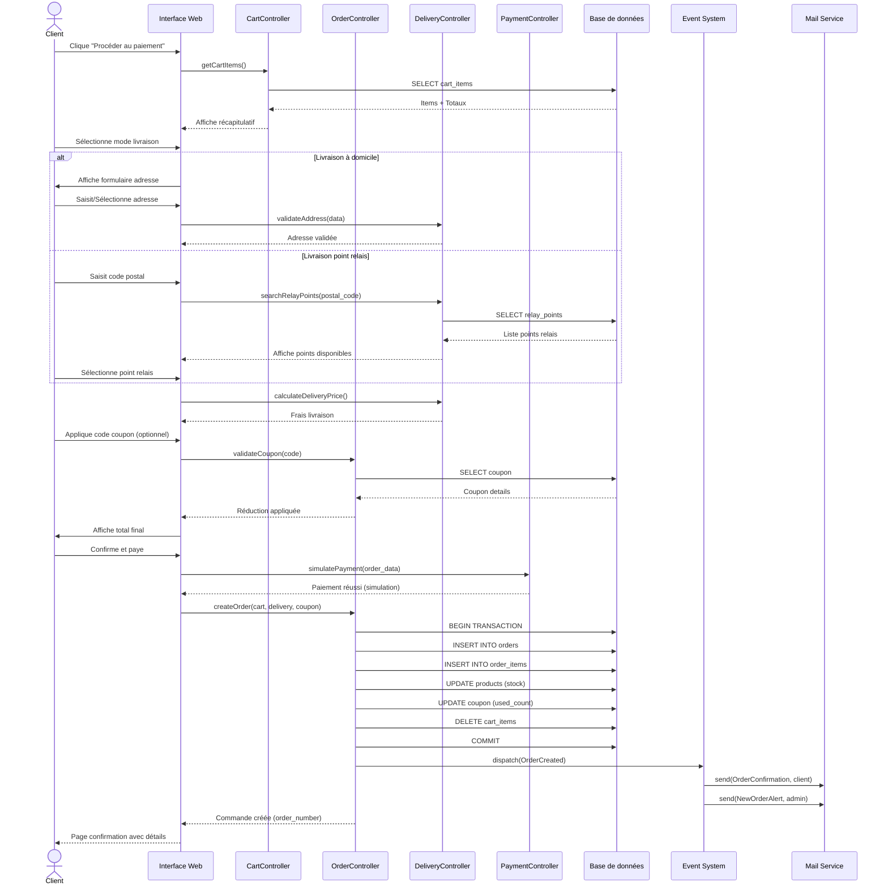
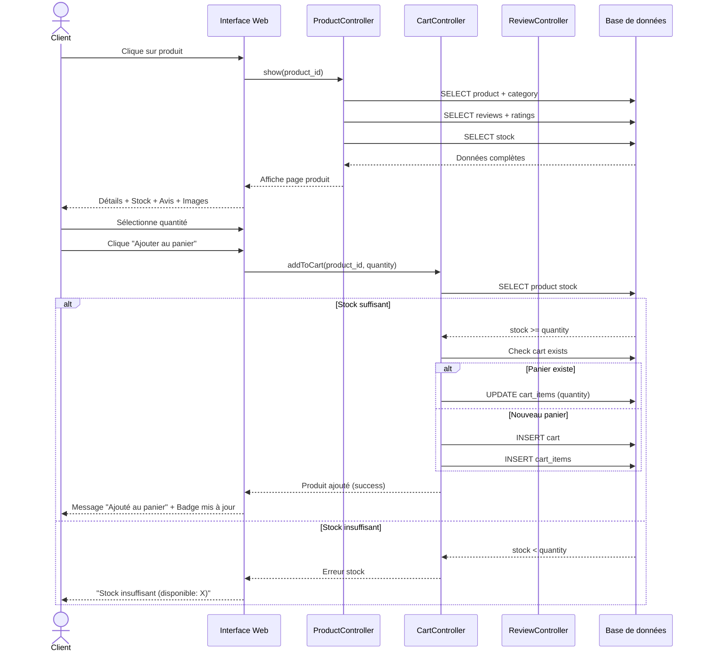
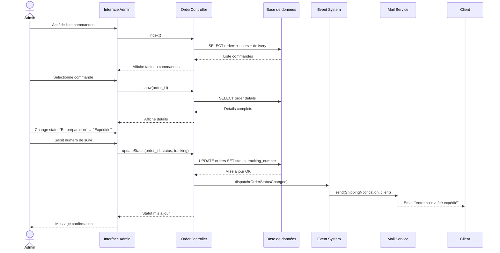
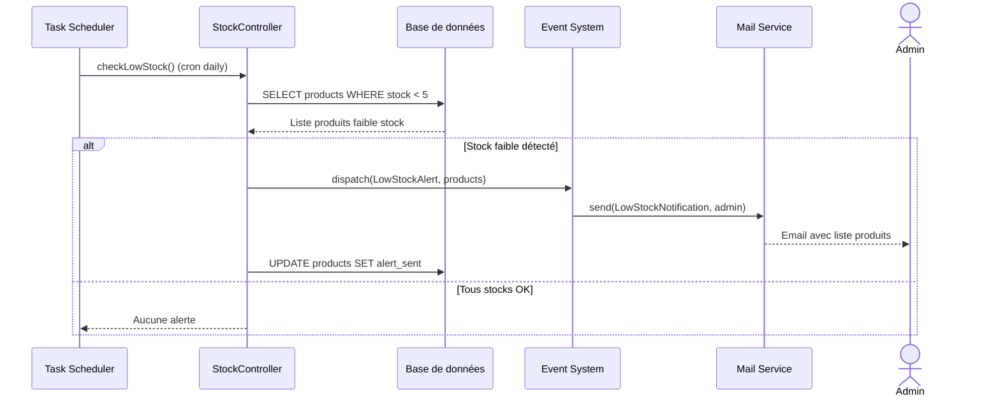
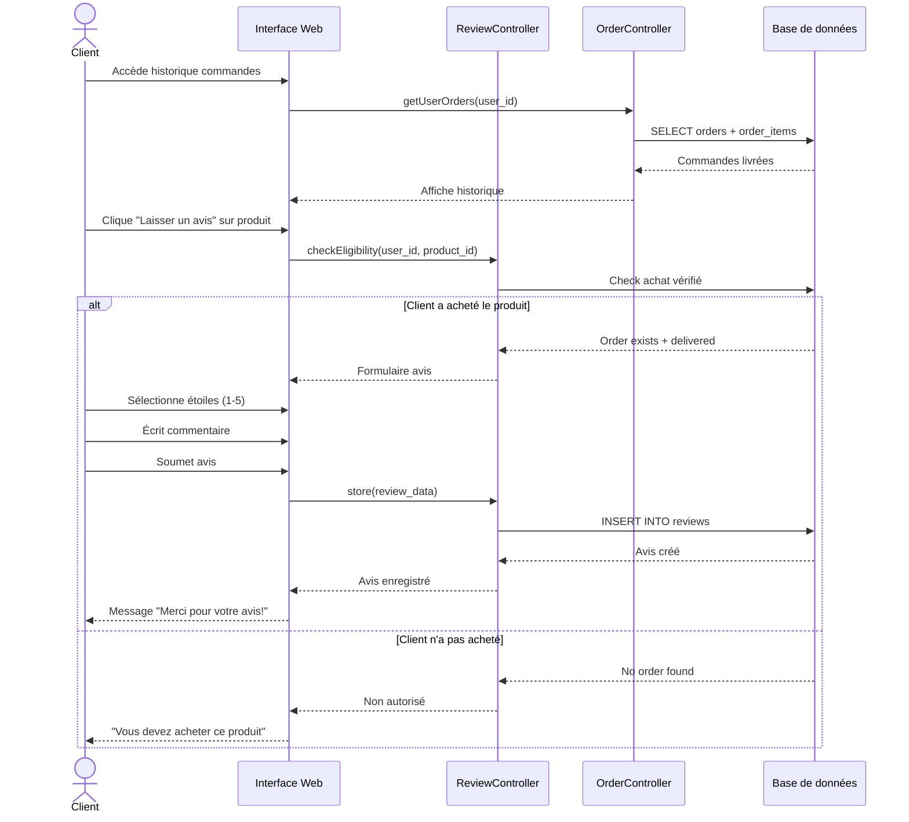

# Diagrammes de Séquence - Mini Amazon

## 🔗 Visualiser les diagrammes
**Lien PlantUML Séquence 1:** [Passage de commande complète](http://www.plantuml.com/plantuml/uml/jLRTRjim57tNhxZoKYM2FeHPQqC8XHYXsq8qPR5ajQkh9AjsYOsuQjxxtSxfqt9fSsfQyOzyzpxxpypqvdVlm7Lxr2Gx2qxWLGNGqGUG0N0d0a9GfG0w0eaGCa5W8PW8OW9Wm3WPG0rW8CW1q1Pq0uG1G2L1k2Lq0-n0Eq0Fq0Gq0Hq0Iq0Jq0Kq0Lq0Mq0Nq0Oq0Pq0Qq0Rq0Sq0Tq0Uq0Vq0Wq0Xq0Yq0Zq10q11q12q13q14q15q16q17q18q19q20q21q22q23q24q25q26q27q28q29q30q31q32q33q34q35q36q37q38q39q40q41q42q43q44q45q46q)

## 1. Séquence: Passage de Commande Complète

---

## 2. Séquence: Consultation Produit et Ajout au Panier

---

## 3. Séquence: Gestion Admin - Changement Statut Commande

---

## 4. Séquence: Système - Alerte Stock Faible

---

## 5. Séquence: Client - Laisser un Avis

