# Diagrammes de Séquence - Mini Amazon

## 🔗 Visualiser les diagrammes
**Lien PlantUML Séquence 1:** [Passage de commande complète](http://www.plantuml.com/plantuml/uml/jLRTRjim57tNhxZoKYM2FeHPQqC8XHYXsq8qPR5ajQkh9AjsYOsuQjxxtSxfqt9fSsfQyOzyzpxxpypqvdVlm7Lxr2Gx2qxWLGNGqGUG0N0d0a9GfG0w0eaGCa5W8PW8OW9Wm3WPG0rW8CW1q1Pq0uG1G2L1k2Lq0-n0Eq0Fq0Gq0Hq0Iq0Jq0Kq0Lq0Mq0Nq0Oq0Pq0Qq0Rq0Sq0Tq0Uq0Vq0Wq0Xq0Yq0Zq10q11q12q13q14q15q16q17q18q19q20q21q22q23q24q25q26q27q28q29q30q31q32q33q34q35q36q37q38q39q40q41q42q43q44q45q46q)

## 1. Séquence: Passage de Commande Complète

```mermaid
sequenceDiagram
    actor Client
    participant UI as Interface Web
    participant CartCtrl as CartController
    participant OrderCtrl as OrderController
    participant DeliveryCtrl as DeliveryController
    participant PaymentCtrl as PaymentController
    participant DB as Base de données
    participant Event as Event System
    participant Mail as Mail Service

    Client->>UI: Clique "Procéder au paiement"
    UI->>CartCtrl: getCartItems()
    CartCtrl->>DB: SELECT cart_items
    DB-->>CartCtrl: Items + Totaux
    CartCtrl-->>UI: Affiche récapitulatif

    Client->>UI: Sélectionne mode livraison
    
    alt Livraison à domicile
        UI->>Client: Affiche formulaire adresse
        Client->>UI: Saisit/Sélectionne adresse
        UI->>DeliveryCtrl: validateAddress(data)
        DeliveryCtrl-->>UI: Adresse validée
    else Livraison point relais
        Client->>UI: Saisit code postal
        UI->>DeliveryCtrl: searchRelayPoints(postal_code)
        DeliveryCtrl->>DB: SELECT relay_points
        DB-->>DeliveryCtrl: Liste points relais
        DeliveryCtrl-->>UI: Affiche points disponibles
        Client->>UI: Sélectionne point relais
    end

    UI->>DeliveryCtrl: calculateDeliveryPrice()
    DeliveryCtrl-->>UI: Frais livraison

    Client->>UI: Applique code coupon (optionnel)
    UI->>OrderCtrl: validateCoupon(code)
    OrderCtrl->>DB: SELECT coupon
    DB-->>OrderCtrl: Coupon details
    OrderCtrl-->>UI: Réduction appliquée

    UI->>Client: Affiche total final
    Client->>UI: Confirme et paye

    UI->>PaymentCtrl: simulatePayment(order_data)
    PaymentCtrl-->>UI: Paiement réussi (simulation)

    UI->>OrderCtrl: createOrder(cart, delivery, coupon)
    OrderCtrl->>DB: BEGIN TRANSACTION
    OrderCtrl->>DB: INSERT INTO orders
    OrderCtrl->>DB: INSERT INTO order_items
    OrderCtrl->>DB: UPDATE products (stock)
    OrderCtrl->>DB: UPDATE coupon (used_count)
    OrderCtrl->>DB: DELETE cart_items
    OrderCtrl->>DB: COMMIT

    OrderCtrl->>Event: dispatch(OrderCreated)
    Event->>Mail: send(OrderConfirmation, client)
    Event->>Mail: send(NewOrderAlert, admin)

    OrderCtrl-->>UI: Commande créée (order_number)
    UI-->>Client: Page confirmation avec détails
```

---

## 2. Séquence: Consultation Produit et Ajout au Panier

```mermaid
sequenceDiagram
    actor Client
    participant UI as Interface Web
    participant ProductCtrl as ProductController
    participant CartCtrl as CartController
    participant ReviewCtrl as ReviewController
    participant DB as Base de données

    Client->>UI: Clique sur produit
    UI->>ProductCtrl: show(product_id)
    ProductCtrl->>DB: SELECT product + category
    ProductCtrl->>DB: SELECT reviews + ratings
    ProductCtrl->>DB: SELECT stock
    DB-->>ProductCtrl: Données complètes
    ProductCtrl-->>UI: Affiche page produit

    UI-->>Client: Détails + Stock + Avis + Images

    Client->>UI: Sélectionne quantité
    Client->>UI: Clique "Ajouter au panier"

    UI->>CartCtrl: addToCart(product_id, quantity)
    CartCtrl->>DB: SELECT product stock
    
    alt Stock suffisant
        DB-->>CartCtrl: stock >= quantity
        CartCtrl->>DB: Check cart exists
        alt Panier existe
            CartCtrl->>DB: UPDATE cart_items (quantity)
        else Nouveau panier
            CartCtrl->>DB: INSERT cart
            CartCtrl->>DB: INSERT cart_items
        end
        CartCtrl-->>UI: Produit ajouté (success)
        UI-->>Client: Message "Ajouté au panier" + Badge mis à jour
    else Stock insuffisant
        DB-->>CartCtrl: stock < quantity
        CartCtrl-->>UI: Erreur stock
        UI-->>Client: "Stock insuffisant (disponible: X)"
    end
```

---

## 3. Séquence: Gestion Admin - Changement Statut Commande

```mermaid
sequenceDiagram
    actor Admin
    participant UI as Interface Admin
    participant OrderCtrl as OrderController
    participant DB as Base de données
    participant Event as Event System
    participant Mail as Mail Service

    Admin->>UI: Accède liste commandes
    UI->>OrderCtrl: index()
    OrderCtrl->>DB: SELECT orders + users + delivery
    DB-->>OrderCtrl: Liste commandes
    OrderCtrl-->>UI: Affiche tableau commandes

    Admin->>UI: Sélectionne commande
    UI->>OrderCtrl: show(order_id)
    OrderCtrl->>DB: SELECT order details
    DB-->>OrderCtrl: Détails complets
    OrderCtrl-->>UI: Affiche détails

    Admin->>UI: Change statut "En préparation" → "Expédiée"
    Admin->>UI: Saisit numéro de suivi

    UI->>OrderCtrl: updateStatus(order_id, status, tracking)
    OrderCtrl->>DB: UPDATE orders SET status, tracking_number
    DB-->>OrderCtrl: Mise à jour OK

    OrderCtrl->>Event: dispatch(OrderStatusChanged)
    Event->>Mail: send(ShippingNotification, client)
    Mail-->>Client: Email "Votre colis a été expédié"

    OrderCtrl-->>UI: Statut mis à jour
    UI-->>Admin: Message confirmation
```

---

## 4. Séquence: Système - Alerte Stock Faible

---

## 5. Séquence: Client - Laisser un Avis

```mermaid
sequenceDiagram
    actor Client
    participant UI as Interface Web
    participant ReviewCtrl as ReviewController
    participant OrderCtrl as OrderController
    participant DB as Base de données

    Client->>UI: Accède historique commandes
    UI->>OrderCtrl: getUserOrders(user_id)
    OrderCtrl->>DB: SELECT orders + order_items
    DB-->>OrderCtrl: Commandes livrées
    OrderCtrl-->>UI: Affiche historique

    Client->>UI: Clique "Laisser un avis" sur produit
    UI->>ReviewCtrl: checkEligibility(user_id, product_id)
    ReviewCtrl->>DB: Check achat vérifié
    
    alt Client a acheté le produit
        DB-->>ReviewCtrl: Order exists + delivered
        ReviewCtrl-->>UI: Formulaire avis
        Client->>UI: Sélectionne étoiles (1-5)
        Client->>UI: Écrit commentaire
        Client->>UI: Soumet avis

        UI->>ReviewCtrl: store(review_data)
        ReviewCtrl->>DB: INSERT INTO reviews
        DB-->>ReviewCtrl: Avis créé
        ReviewCtrl-->>UI: Avis enregistré
        UI-->>Client: Message "Merci pour votre avis!"
    else Client n'a pas acheté
        DB-->>ReviewCtrl: No order found
        ReviewCtrl-->>UI: Non autorisé
        UI-->>Client: "Vous devez acheter ce produit"
    end
```

