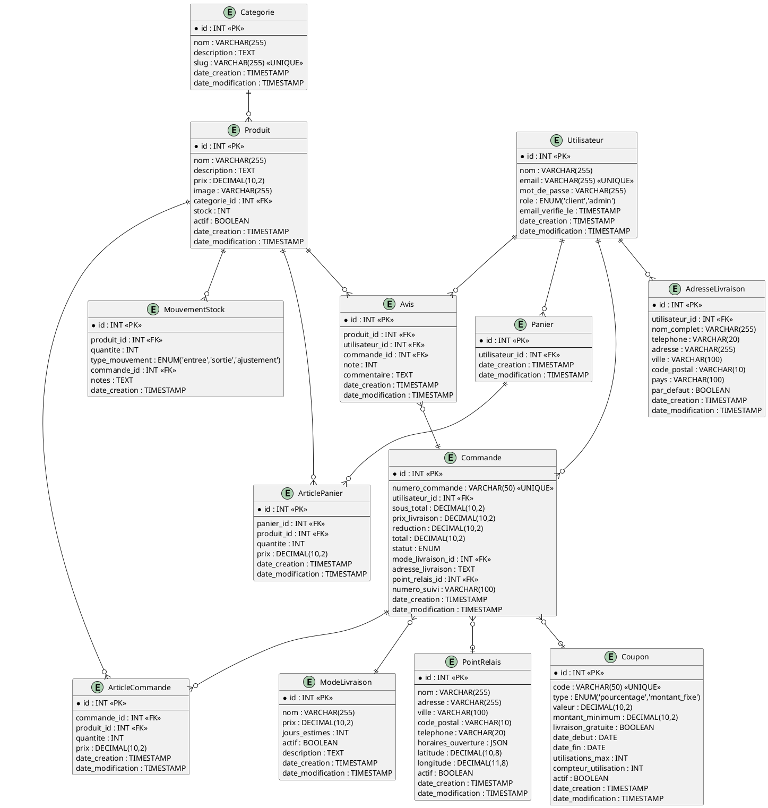
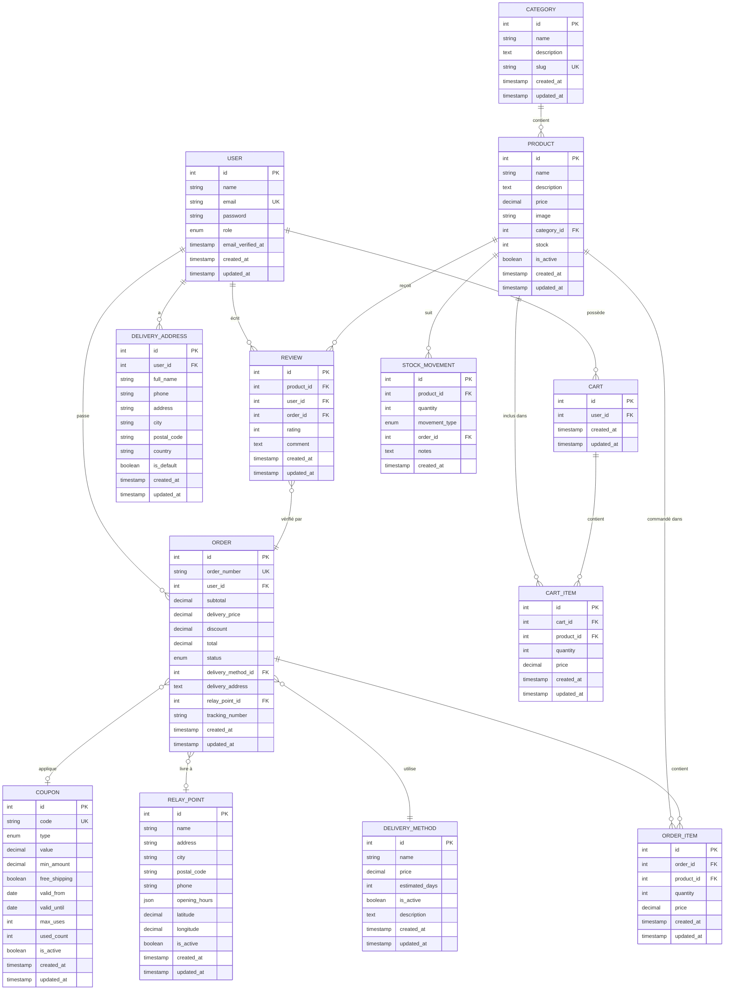

# Modèle Conceptuel des Données (MCD) - Mini Amazon

## 🔗 Visualiser le diagramme
**Lien PlantUML:** [Voir le MCD complet](http://www.plantuml.com/plantuml/uml/bLLjRziu4FxENt7HqYM3OjHLmWP5YWP5eKP5gKO8Y4aY9QoYaYaYb4YcGYd0Yd1Ye2Yf3Yg4Yh5Yi6Yj7Yk8Yl9YmAYnBYoCYpDYqEYrFYsGYtHYuIYvJYwKYxLYyMYzNY-OY_PYARYBSYCTYDUYEVYFWYGXYHYYIZYJaYKbYLcYMdYNeYOfYPgYQhYRiYSjYTkYUlYVmYWnYXoYYpYZqY-rY_sYAtYBuYCvYDwYExYFyYGzYH-YI_YJAYKCYLDYMEYNG)

## Diagramme Entité-Association





---

## Cardinalités Détaillées

### Relations Principales

| Entité 1 | Cardinalité | Relation | Cardinalité | Entité 2 |
|----------|-------------|----------|-------------|----------|
| **USER** | 1,1 | possède | 0,N | **CART** |
| **USER** | 1,1 | passe | 0,N | **ORDER** |
| **USER** | 1,1 | a | 0,N | **DELIVERY_ADDRESS** |
| **USER** | 1,1 | écrit | 0,N | **REVIEW** |
| **CATEGORY** | 1,1 | contient | 0,N | **PRODUCT** |
| **PRODUCT** | 1,1 | inclus dans | 0,N | **CART_ITEM** |
| **PRODUCT** | 1,1 | commandé dans | 0,N | **ORDER_ITEM** |
| **PRODUCT** | 1,1 | reçoit | 0,N | **REVIEW** |
| **PRODUCT** | 1,1 | suit | 0,N | **STOCK_MOVEMENT** |
| **CART** | 1,1 | contient | 0,N | **CART_ITEM** |
| **ORDER** | 1,1 | contient | 1,N | **ORDER_ITEM** |
| **ORDER** | 0,N | utilise | 1,1 | **DELIVERY_METHOD** |
| **ORDER** | 0,N | livre à | 0,1 | **RELAY_POINT** |
| **ORDER** | 0,N | applique | 0,1 | **COUPON** |
| **REVIEW** | 0,N | vérifié par | 1,1 | **ORDER** |

---

## Contraintes d'Intégrité

### Contraintes Référentielles
- `product.category_id` → `category.id` (ON DELETE RESTRICT)
- `cart.user_id` → `user.id` (ON DELETE CASCADE)
- `cart_item.cart_id` → `cart.id` (ON DELETE CASCADE)
- `cart_item.product_id` → `product.id` (ON DELETE CASCADE)
- `order.user_id` → `user.id` (ON DELETE RESTRICT)
- `order.delivery_method_id` → `delivery_method.id` (ON DELETE RESTRICT)
- `order.relay_point_id` → `relay_point.id` (ON DELETE SET NULL)
- `order_item.order_id` → `order.id` (ON DELETE CASCADE)
- `order_item.product_id` → `product.id` (ON DELETE RESTRICT)
- `delivery_address.user_id` → `user.id` (ON DELETE CASCADE)
- `review.product_id` → `product.id` (ON DELETE CASCADE)
- `review.user_id` → `user.id` (ON DELETE CASCADE)
- `review.order_id` → `order.id` (ON DELETE CASCADE)
- `stock_movement.product_id` → `product.id` (ON DELETE CASCADE)

### Contraintes Métier
1. **Stock** : `product.stock >= 0`
2. **Prix** : `product.price > 0`
3. **Quantité** : `cart_item.quantity > 0` AND `order_item.quantity > 0`
4. **Note** : `review.rating BETWEEN 1 AND 5`
5. **Statut commande** : `order.status IN ('pending', 'confirmed', 'preparing', 'shipped', 'in_delivery', 'delivered', 'cancelled')`
6. **Type coupon** : `coupon.type IN ('percentage', 'fixed_amount')`
7. **Validité coupon** : `coupon.valid_from < coupon.valid_until`
8. **Usage coupon** : `coupon.used_count <= coupon.max_uses`
9. **Email unique** : `user.email` UNIQUE
10. **Code coupon unique** : `coupon.code` UNIQUE
11. **Numéro commande unique** : `order.order_number` UNIQUE
12. **Adresse par défaut** : Un seul `delivery_address.is_default = true` par utilisateur
13. **Livraison mutuelle exclusive** : Si `order.relay_point_id IS NOT NULL` alors `delivery_address` contient adresse point relais, sinon adresse client

### Règles de Calcul
- `order.subtotal` = Σ(`order_item.price` × `order_item.quantity`)
- `order.discount` = Calculé selon `coupon.type` et `coupon.value`
- `order.total` = `subtotal` + `delivery_price` - `discount`
- Moyenne rating produit = AVG(`review.rating`) WHERE `product_id` = X

---

## Index Recommandés

```sql
-- Performance recherche
CREATE INDEX idx_product_name ON product(name);
CREATE INDEX idx_product_category ON product(category_id);
CREATE INDEX idx_product_stock ON product(stock);
CREATE INDEX idx_product_active ON product(is_active);

-- Performance commandes
CREATE INDEX idx_order_user ON order(user_id);
CREATE INDEX idx_order_status ON order(status);
CREATE INDEX idx_order_created ON order(created_at);
CREATE INDEX idx_order_number ON order(order_number);

-- Performance panier
CREATE INDEX idx_cart_user ON cart(user_id);
CREATE INDEX idx_cart_item_cart ON cart_item(cart_id);

-- Performance avis
CREATE INDEX idx_review_product ON review(product_id);
CREATE INDEX idx_review_rating ON review(rating);

-- Performance livraison
CREATE INDEX idx_relay_postal ON relay_point(postal_code);
CREATE INDEX idx_relay_active ON relay_point(is_active);

-- Performance coupons
CREATE INDEX idx_coupon_code ON coupon(code);
CREATE INDEX idx_coupon_valid ON coupon(valid_from, valid_until);
```

---

## Types ENUM

### order.status
- `pending` : En attente
- `confirmed` : Confirmée
- `preparing` : En préparation
- `shipped` : Expédiée
- `in_delivery` : En cours de livraison
- `delivered` : Livrée
- `cancelled` : Annulée

### coupon.type
- `percentage` : Pourcentage (ex: 10%)
- `fixed_amount` : Montant fixe (ex: 5€)

### user.role
- `customer` : Client
- `admin` : Administrateur

### stock_movement.movement_type
- `in` : Entrée stock (réapprovisionnement)
- `out` : Sortie stock (vente)
- `adjustment` : Ajustement inventaire
