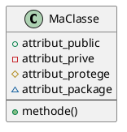
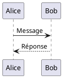

# 📐 Fichiers PlantUML - Mini Amazon

## 🎯 Utilisation

Ce dossier contient tous les fichiers sources PlantUML (`.puml`) pour générer les diagrammes du projet.

---

## 📂 Fichiers Disponibles

### 1. diagramme-classe.puml
Diagramme de classes complet avec toutes les entités du système.

**Générer l'image:**
```bash
plantuml diagramme-classe.puml
```

**Visualiser en ligne:**
```
http://www.plantuml.com/plantuml/uml/[CODE_ENCODÉ]
```

---

### 2. diagramme-sequence-commande.puml
Séquence détaillée du processus de passage de commande.

**Générer l'image:**
```bash
plantuml diagramme-sequence-commande.puml
```

---

## 🚀 Installation PlantUML

### Option 1: Extension VS Code
1. Ouvrir VS Code
2. Installer l'extension **PlantUML** (jebbs.plantuml)
3. Ouvrir un fichier `.puml`
4. Appuyer sur `Alt+D` pour prévisualiser

### Option 2: Ligne de commande
```bash
# Installer Java (requis)
# Télécharger plantuml.jar
wget https://sourceforge.net/projects/plantuml/files/plantuml.jar/download -O plantuml.jar

# Générer un diagramme
java -jar plantuml.jar diagramme-classe.puml
```

### Option 3: npm
```bash
npm install -g node-plantuml

# Générer
puml generate diagramme-classe.puml -o output.png
```

---

## 🖼️ Formats de Sortie

PlantUML supporte plusieurs formats:

```bash
# PNG (par défaut)
plantuml diagramme-classe.puml

# SVG (vectoriel)
plantuml -tsvg diagramme-classe.puml

# PDF
plantuml -tpdf diagramme-classe.puml

# ASCII Art
plantuml -ttxt diagramme-classe.puml
```

---

## 🎨 Personnalisation

### Thèmes disponibles
```plantuml
!theme plain        ' Classique noir et blanc
!theme bluegray     ' Moderne bleu-gris
!theme sketchy      ' Style dessiné à la main
!theme carbon       ' Sombre (Dark mode)
```

### Couleurs personnalisées
```plantuml
skinparam backgroundColor #FFFFFF
skinparam classBorderColor #000000
skinparam classBackgroundColor #F0F0F0
```

---

## 🔗 Liens Utiles

- **Documentation PlantUML:** https://plantuml.com/fr/
- **Galerie d'exemples:** https://real-world-plantuml.com/
- **Éditeur en ligne:** http://www.plantuml.com/plantuml/uml/
- **Syntaxe de référence:** https://plantuml.com/fr/guide

---

## 📝 Syntaxe Rapide

### Diagramme de Classes


### Diagramme de Séquence


### Relations
```plantuml
ClasseA -- ClasseB : Association
ClasseA --> ClasseB : Flèche
ClasseA --o ClasseB : Agrégation
ClasseA --* ClasseB : Composition
ClasseA --|> ClasseB : Héritage
ClasseA ..|> ClasseB : Implémente
```

---

## 🐛 Dépannage

### Erreur: Java introuvable
```bash
# Installer Java
sudo apt install default-jre  # Linux
brew install java             # macOS
# Windows: Télécharger depuis java.com
```

### Erreur: Graphviz manquant
Certains diagrammes nécessitent Graphviz:
```bash
sudo apt install graphviz     # Linux
brew install graphviz         # macOS
# Windows: https://graphviz.org/download/
```

### Caractères spéciaux
Si les accents ne s'affichent pas:
```plantuml
@startuml
skinparam defaultFontName Arial
@enduml
```

---

## 📊 Export vers Documentation

### Intégration dans Markdown
```markdown

```

### Intégration dans LaTeX
```latex
\includegraphics[width=\textwidth]{diagramme-classe.pdf}
```

### Intégration dans HTML
```html

```

---

## 🔄 Scripts Utiles

### Générer tous les diagrammes
```bash
#!/bin/bash
# generate-all.sh
for file in *.puml; do
    echo "Génération de $file..."
    plantuml "$file"
done
```

### Watch mode (regénération automatique)
```bash
plantuml -w diagramme-classe.puml
# Regénère à chaque modification
```

---

## ✅ Checklist Qualité

Avant de valider un diagramme:
- [ ] Noms en français
- [ ] Cardinalités correctes
- [ ] Légende incluse si nécessaire
- [ ] Pas de chevauchement d'éléments
- [ ] Taille lisible (ni trop petit ni trop grand)
- [ ] Couleurs accessibles (contraste suffisant)
- [ ] Export en PNG et SVG
